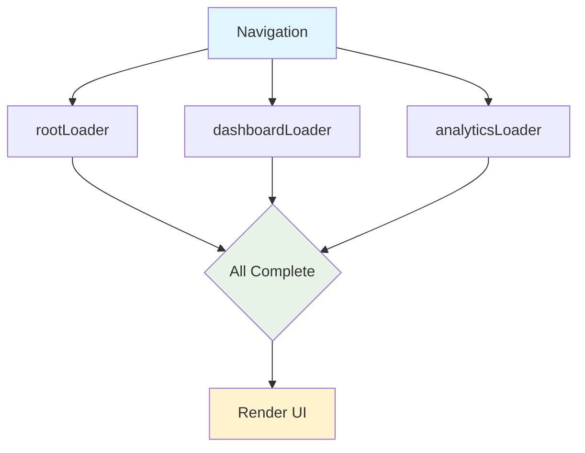
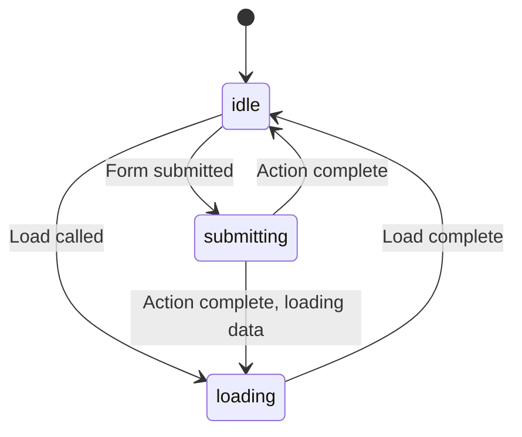
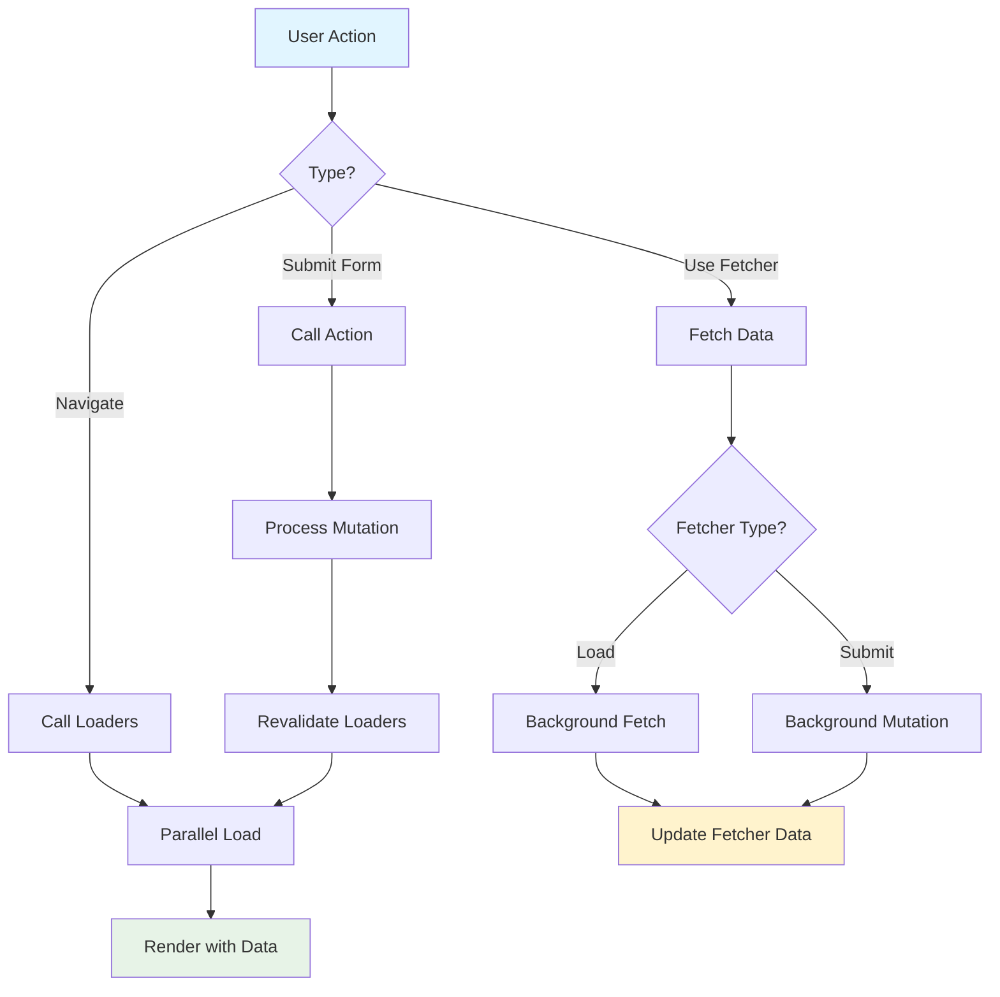

# Data Fetching Patterns

React Router provides powerful data fetching primitives that eliminate loading states, race conditions, and enable advanced patterns like parallel loading, deferred data, and optimistic UI.

## Core Data Fetching

### Route Loaders

Loaders are the primary way to fetch data:

```tsx
// app/routes/products.tsx
export async function loader() {
  const products = await db.products.findAll();
  return { products };
}

export default function Products() {
  const { products } = useLoaderData<typeof loader>();
  return (
    <ul>
      {products.map(p => <li key={p.id}>{p.name}</li>)}
    </ul>
  );
}
```

### Parallel Loading

Nested routes load data in parallel automatically:

```tsx
const routes = [
  {
    path: "/",
    loader: rootLoader,      // Loads: session, user
    children: [
      {
        path: "dashboard",
        loader: dashboardLoader, // Loads: stats, notifications
        children: [
          {
            path: "analytics",
            loader: analyticsLoader, // Loads: charts, metrics
          }
        ]
      }
    ]
  }
];

// All three loaders run in parallel!
```



### Sequential Loading

When you need data from a parent:

```tsx
// Parent loader
export async function loader({ params }) {
  const user = await getUser(params.userId);
  return { user };
}

// Child loader - runs after parent
export async function loader({ params, context }) {
  // Access parent data via useRouteLoaderData in component
  // or fetch based on params
  const posts = await db.posts.findByUser(params.userId);
  return { posts };
}
```

## Fetchers

Fetchers let you load data without navigation:

```tsx
import { useFetcher } from "react-router";

function NewsletterSignup() {
  const fetcher = useFetcher();
  
  return (
    <fetcher.Form method="post" action="/newsletter">
      <input name="email" />
      <button type="submit">
        {fetcher.state === "submitting" ? "Subscribing..." : "Subscribe"}
      </button>
      {fetcher.data?.success && <p>Thanks!</p>}
    </fetcher.Form>
  );
}
```

### Fetcher States



From `lib/router/router.ts`, fetcher states:

```tsx
type Fetcher = 
  | { state: "idle"; data?: unknown }
  | { state: "loading"; formData?: FormData; data?: unknown }
  | { state: "submitting"; formData: FormData; data?: unknown };
```

### Fetcher Examples

```tsx
import { useFetcher } from "react-router";

// Load data without navigation
function RelatedProducts({ productId }) {
  const fetcher = useFetcher();
  
  useEffect(() => {
    if (fetcher.state === "idle" && !fetcher.data) {
      fetcher.load(`/api/products/${productId}/related`);
    }
  }, [productId]);
  
  if (!fetcher.data) return <Spinner />;
  
  return (
    <div>
      {fetcher.data.products.map(p => <ProductCard key={p.id} {...p} />)}
    </div>
  );
}

// Submit without navigation
function AddToCart({ productId }) {
  const fetcher = useFetcher();
  
  return (
    <fetcher.Form method="post" action="/cart">
      <input type="hidden" name="productId" value={productId} />
      <button type="submit">
        {fetcher.state === "submitting" ? "Adding..." : "Add to Cart"}
      </button>
    </fetcher.Form>
  );
}
```

## Deferred Data

Stream slow data for better UX:

```tsx
import { defer, Await } from "react-router";
import { Suspense } from "react";

// Loader
export async function loader() {
  // Wait for critical data
  const product = await getProduct();
  
  // Don't wait for slow data
  const reviewsPromise = getReviews(); // Returns promise
  
  return defer({
    product,
    reviews: reviewsPromise, // Stream this
  });
}

// Component
export default function Product() {
  const { product, reviews } = useLoaderData<typeof loader>();
  
  return (
    <div>
      <h1>{product.name}</h1>
      <p>{product.description}</p>
      
      <Suspense fallback={<ReviewsSkeleton />}>
        <Await resolve={reviews} errorElement={<ReviewsError />}>
          {(resolvedReviews) => (
            <Reviews items={resolvedReviews} />
          )}
        </Await>
      </Suspense>
    </div>
  );
}
```

### When to Defer

```tsx
// ✅ Good: Defer slow, non-critical data
return defer({
  product: await getProduct(),        // Fast, critical
  reviews: getReviews(),              // Slow, can wait
  recommendations: getRecommendations() // Slow, can wait
});

// ❌ Bad: Deferring everything delays user interaction
return defer({
  product: getProduct(),  // User needs this immediately!
  name: getName(),        // Also critical
});
```

## Revalidation

Data automatically refreshes after mutations:

```tsx
// Mutation happens
export async function action({ request }) {
  await createProduct(await request.formData());
  return redirect("/products");
}

// This loader automatically re-runs
export async function loader() {
  return { products: await db.products.findAll() };
}
```

### Manual Revalidation

```tsx
import { useRevalidator } from "react-router";

function ProductList() {
  const revalidator = useRevalidator();
  
  // Poll for updates
  useEffect(() => {
    const interval = setInterval(() => {
      if (document.visibilityState === "visible") {
        revalidator.revalidate();
      }
    }, 5000);
    
    return () => clearInterval(interval);
  }, []);
  
  return (
    <div>
      {revalidator.state === "loading" && <Spinner />}
      {/* content */}
    </div>
  );
}
```

### Controlling Revalidation

```tsx
export function shouldRevalidate({
  currentParams,
  nextParams,
  formMethod,
  defaultShouldRevalidate,
}) {
  // Only revalidate if ID changed
  if (currentParams.id !== nextParams.id) {
    return true;
  }
  
  // Don't revalidate on search param changes
  if (currentUrl.searchParams.toString() !== nextUrl.searchParams.toString()) {
    return false;
  }
  
  return defaultShouldRevalidate;
}
```

## Optimistic UI

Update UI immediately, then confirm:

```tsx
import { useFetcher, useLoaderData } from "react-router";

function TodoItem({ todo }) {
  const fetcher = useFetcher();
  
  // Optimistic state
  const isComplete = fetcher.formData
    ? fetcher.formData.get("complete") === "true"
    : todo.complete;
  
  return (
    <fetcher.Form method="post">
      <input
        type="checkbox"
        name="complete"
        value="true"
        checked={isComplete}
        onChange={(e) => fetcher.submit(e.currentTarget.form)}
      />
      <span style={{ 
        textDecoration: isComplete ? "line-through" : "none" 
      }}>
        {todo.title}
      </span>
    </fetcher.Form>
  );
}
```

## Client-Side Caching

Implement caching with client loaders:

```tsx
const cache = new Map();

export async function clientLoader({ params, serverLoader }) {
  const cacheKey = `product-${params.id}`;
  
  // Check cache
  if (cache.has(cacheKey)) {
    const cached = cache.get(cacheKey);
    if (Date.now() - cached.timestamp < 60000) { // 1 minute
      return cached.data;
    }
  }
  
  // Fetch fresh data
  const data = await serverLoader();
  
  // Update cache
  cache.set(cacheKey, {
    data,
    timestamp: Date.now(),
  });
  
  return data;
}
```

## Error Handling

### Loader Errors

```tsx
export async function loader({ params }) {
  const product = await db.products.find(params.id);
  
  if (!product) {
    throw new Response("Product not found", { 
      status: 404,
      statusText: "Not Found" 
    });
  }
  
  return { product };
}

export function ErrorBoundary() {
  const error = useRouteError();
  
  if (isRouteErrorResponse(error) && error.status === 404) {
    return <div>This product doesn't exist!</div>;
  }
  
  return <div>Something went wrong</div>;
}
```

### Fetcher Errors

```tsx
function Component() {
  const fetcher = useFetcher();
  
  return (
    <div>
      <button onClick={() => fetcher.load("/api/data")}>Load</button>
      
      {fetcher.data?.error && (
        <div>Error: {fetcher.data.error}</div>
      )}
    </div>
  );
}
```

## Data Access Patterns

### Parent Data

```tsx
import { useRouteLoaderData } from "react-router";

function ChildRoute() {
  // Access data from any parent route by ID
  const rootData = useRouteLoaderData("root");
  const { user } = rootData;
  
  return <div>Hello {user.name}</div>;
}
```

### All Route Data

```tsx
import { useMatches } from "react-router";

function Breadcrumbs() {
  const matches = useMatches();
  
  return (
    <nav>
      {matches.map((match) => (
        <Link key={match.id} to={match.pathname}>
          {match.handle?.breadcrumb || match.pathname}
        </Link>
      ))}
    </nav>
  );
}
```

## Advanced Patterns

### Prefetching

```tsx
import { prefetchRoute } from "react-router";

function ProductCard({ product }) {
  return (
    <Link
      to={`/products/${product.id}`}
      onMouseEnter={() => {
        prefetchRoute(`/products/${product.id}`);
      }}
    >
      {product.name}
    </Link>
  );
}
```

### Infinite Scroll

```tsx
function InfiniteList() {
  const { items } = useLoaderData();
  const fetcher = useFetcher();
  const [allItems, setAllItems] = useState(items);
  
  useEffect(() => {
    if (fetcher.data) {
      setAllItems(prev => [...prev, ...fetcher.data.items]);
    }
  }, [fetcher.data]);
  
  function loadMore() {
    fetcher.load(`/api/items?offset=${allItems.length}`);
  }
  
  return (
    <div>
      {allItems.map(item => <Item key={item.id} {...item} />)}
      <button onClick={loadMore}>
        {fetcher.state === "loading" ? "Loading..." : "Load More"}
      </button>
    </div>
  );
}
```

### Polling

```tsx
function LiveData() {
  const revalidator = useRevalidator();
  
  useEffect(() => {
    const interval = setInterval(() => {
      if (document.visibilityState === "visible") {
        revalidator.revalidate();
      }
    }, 5000);
    
    return () => clearInterval(interval);
  }, []);
  
  return <div>{/* UI */}</div>;
}
```

## Data Flow Diagram



## Best Practices

1. **Load in parallel** - Use nested routes for automatic parallelization
2. **Defer slow data** - Keep pages interactive with Suspense
3. **Use fetchers for interactions** - Add to cart, likes, etc.
4. **Implement optimistic UI** - Better perceived performance
5. **Handle errors gracefully** - Provide meaningful error boundaries
6. **Cache strategically** - Use client loaders for expensive data
7. **Revalidate intelligently** - Control with shouldRevalidate
8. **Prefetch on hover** - Improve navigation perceived performance
