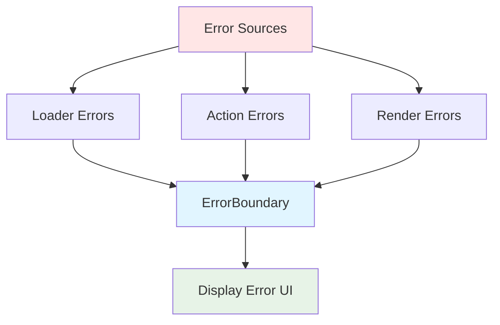
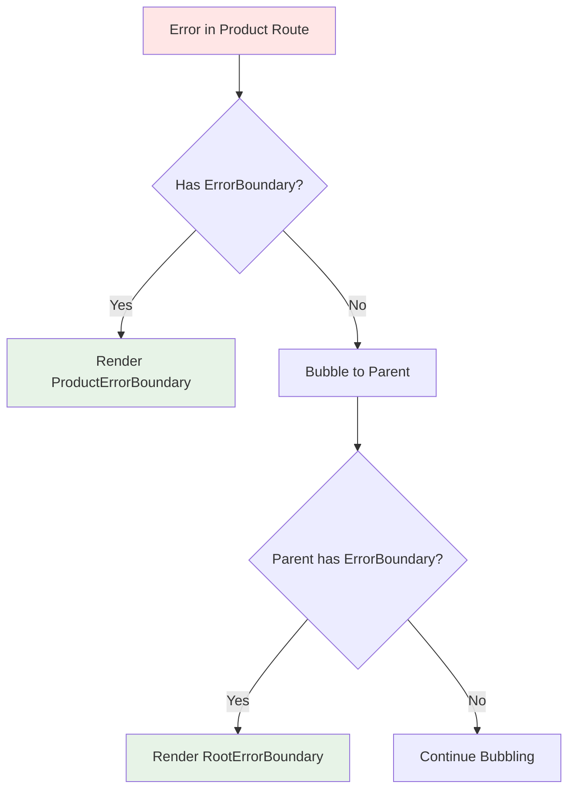

# Error Boundaries

React Router provides automatic error handling through Error Boundaries that catch errors from loaders, actions, and component rendering. This enables graceful error recovery without crashing your entire app.

## Basic Error Boundary

Every route can export an ErrorBoundary component:

```tsx
import { useRouteError, isRouteErrorResponse } from "react-router";

export default function ProductPage() {
  const { product } = useLoaderData();
  return <h1>{product.name}</h1>;
}

export function ErrorBoundary() {
  const error = useRouteError();
  
  if (isRouteErrorResponse(error)) {
    return (
      <div>
        <h1>{error.status} {error.statusText}</h1>
        <p>{error.data}</p>
      </div>
    );
  }
  
  return (
    <div>
      <h1>Oops!</h1>
      <p>Something went wrong.</p>
    </div>
  );
}
```

## Error Sources

Error boundaries catch errors from multiple sources:



### Loader Errors

```tsx
export async function loader({ params }) {
  const product = await db.products.find(params.id);
  
  if (!product) {
    throw new Response("Not Found", { status: 404 });
  }
  
  return { product };
}
```

### Action Errors

```tsx
export async function action({ request, params }) {
  const formData = await request.formData();
  
  try {
    await db.products.update(params.id, Object.fromEntries(formData));
    return redirect("/products");
  } catch (error) {
    if (error.code === "PERMISSION_DENIED") {
      throw new Response("Forbidden", { status: 403 });
    }
    throw error;
  }
}
```

### Render Errors

```tsx
export default function ProductPage() {
  const { product } = useLoaderData();
  
  // This error is caught by ErrorBoundary
  if (product.price < 0) {
    throw new Error("Invalid product price");
  }
  
  return <div>{product.name}</div>;
}
```

## Error Types

### Route Error Response

Thrown Response objects with status codes:

```tsx
// Throw a Response
throw new Response("Product not found", { 
  status: 404,
  statusText: "Not Found"
});

// Or use the data helper
import { data } from "react-router";

throw data(
  { message: "Product not found", productId: params.id },
  { status: 404 }
);
```

Handling in ErrorBoundary:

```tsx
import { useRouteError, isRouteErrorResponse } from "react-router";

export function ErrorBoundary() {
  const error = useRouteError();
  
  if (isRouteErrorResponse(error)) {
    // error.status: number
    // error.statusText: string
    // error.data: any (from Response body)
    
    if (error.status === 404) {
      return <NotFoundPage />;
    }
    
    if (error.status === 403) {
      return <ForbiddenPage />;
    }
    
    return (
      <div>
        <h1>{error.status} {error.statusText}</h1>
        <pre>{JSON.stringify(error.data, null, 2)}</pre>
      </div>
    );
  }
  
  return <GenericError />;
}
```

### Regular Errors

```tsx
throw new Error("Something went wrong");

// In ErrorBoundary
export function ErrorBoundary() {
  const error = useRouteError();
  
  if (error instanceof Error) {
    return (
      <div>
        <h1>Error</h1>
        <p>{error.message}</p>
        <pre>{error.stack}</pre>
      </div>
    );
  }
}
```

## Error Boundary Hierarchy

Errors bubble up to the nearest route with an ErrorBoundary:

```tsx
const routes = [
  {
    path: "/",
    element: <Root />,
    errorElement: <RootErrorBoundary />, // Catches all unhandled errors
    children: [
      {
        path: "products",
        element: <ProductList />,
        // No errorElement - errors bubble to Root
      },
      {
        path: "products/:id",
        element: <Product />,
        errorElement: <ProductErrorBoundary />, // Catches product errors
      },
    ],
  },
];
```



## Root Error Boundary

Always provide a root-level error boundary:

```tsx
// app/root.tsx
import { 
  Links, 
  Meta, 
  Outlet, 
  Scripts,
  useRouteError,
  isRouteErrorResponse 
} from "react-router";

export function ErrorBoundary() {
  const error = useRouteError();
  
  return (
    <html lang="en">
      <head>
        <Meta />
        <Links />
        <title>
          {isRouteErrorResponse(error)
            ? `${error.status} ${error.statusText}`
            : "Error"}
        </title>
      </head>
      <body>
        <h1>
          {isRouteErrorResponse(error)
            ? `${error.status} ${error.statusText}`
            : "Application Error"}
        </h1>
        {isRouteErrorResponse(error) && (
          <p>{error.data}</p>
        )}
        {error instanceof Error && (
          <>
            <p>{error.message}</p>
            <pre>{error.stack}</pre>
          </>
        )}
        <Scripts /> {/* Include scripts for interactivity */}
      </body>
    </html>
  );
}

export default function Root() {
  return (
    <html lang="en">
      <head>
        <Meta />
        <Links />
      </head>
      <body>
        <Outlet />
        <Scripts />
      </body>
    </html>
  );
}
```

From `lib/dom/ssr/errorBoundaries.tsx:73`, the default error boundary:

```tsx
export function RemixRootDefaultErrorBoundary({
  error,
  isOutsideRemixApp,
}: {
  error: unknown;
  isOutsideRemixApp?: boolean;
}) {
  console.error(error);
  
  if (isRouteErrorResponse(error)) {
    return (
      <BoundaryShell title="Unhandled Thrown Response!">
        <h1 style={{ fontSize: "24px" }}>
          {error.status} {error.statusText}
        </h1>
      </BoundaryShell>
    );
  }
  
  // Handle regular errors...
}
```

## Error Recovery

Users can recover from errors by navigating:

```tsx
import { useNavigate, useRouteError } from "react-router";

export function ErrorBoundary() {
  const error = useRouteError();
  const navigate = useNavigate();
  
  return (
    <div>
      <h1>Something went wrong</h1>
      <p>{error.message}</p>
      <button onClick={() => navigate(-1)}>Go Back</button>
      <button onClick={() => navigate("/")}>Home</button>
    </div>
  );
}
```

From `lib/hooks.tsx:1030`, error boundaries reset on navigation:

```tsx
static getDerivedStateFromProps(
  props: RenderErrorBoundaryProps,
  state: RenderErrorBoundaryState,
) {
  // When location changes, clear the error
  if (state.location !== props.location) {
    return {
      error: props.error,
      location: props.location,
      revalidation: props.revalidation,
    };
  }
  
  return { error: props.error, location: state.location };
}
```

## Contextual Error Messages

```tsx
export async function loader({ params }) {
  const product = await db.products.find(params.id);
  
  if (!product) {
    throw data(
      { 
        message: `Product "${params.id}" not found`,
        suggestions: await db.products.getSimilar(params.id),
      },
      { status: 404 }
    );
  }
  
  return { product };
}

export function ErrorBoundary() {
  const error = useRouteError();
  
  if (isRouteErrorResponse(error) && error.status === 404) {
    return (
      <div>
        <h1>Product Not Found</h1>
        <p>{error.data.message}</p>
        {error.data.suggestions?.length > 0 && (
          <div>
            <h2>Similar Products:</h2>
            <ul>
              {error.data.suggestions.map(p => (
                <li key={p.id}>
                  <Link to={`/products/${p.id}`}>{p.name}</Link>
                </li>
              ))}
            </ul>
          </div>
        )}
      </div>
    );
  }
  
  return <GenericError />;
}
```

## Error Logging

```tsx
import { useRouteError } from "react-router";
import { useEffect } from "react";

export function ErrorBoundary() {
  const error = useRouteError();
  
  useEffect(() => {
    // Log to error tracking service
    if (error instanceof Error) {
      logErrorToService({
        message: error.message,
        stack: error.stack,
        timestamp: new Date().toISOString(),
      });
    }
  }, [error]);
  
  return <ErrorUI error={error} />;
}
```

## Error Boundaries vs Try/Catch

```tsx
// ❌ Don't use try/catch for flow control
export async function loader({ params }) {
  try {
    const product = await db.products.find(params.id);
    return { product };
  } catch (error) {
    // This prevents ErrorBoundary from catching it
    return { error: error.message };
  }
}

// ✅ Let errors throw to ErrorBoundary
export async function loader({ params }) {
  const product = await db.products.find(params.id);
  
  if (!product) {
    throw new Response("Not Found", { status: 404 });
  }
  
  return { product };
}
```

## Validation vs Errors

```tsx
// Validation errors - return them
export async function action({ request }) {
  const formData = await request.formData();
  const errors = validateFormData(formData);
  
  if (errors) {
    return { errors }; // Return, don't throw
  }
  
  // Unexpected errors - throw them
  try {
    await saveData(formData);
  } catch (error) {
    throw error; // Let ErrorBoundary handle
  }
  
  return redirect("/success");
}
```

## Custom Error Classes

```tsx
class NotFoundError extends Error {
  constructor(message: string) {
    super(message);
    this.name = "NotFoundError";
  }
}

class UnauthorizedError extends Error {
  constructor(message: string) {
    super(message);
    this.name = "UnauthorizedError";
  }
}

export async function loader({ params, context }) {
  if (!context.user) {
    throw new UnauthorizedError("Please log in");
  }
  
  const product = await db.products.find(params.id);
  if (!product) {
    throw new NotFoundError(`Product ${params.id} not found`);
  }
  
  return { product };
}

export function ErrorBoundary() {
  const error = useRouteError();
  
  if (error instanceof UnauthorizedError) {
    return <LoginPage message={error.message} />;
  }
  
  if (error instanceof NotFoundError) {
    return <NotFoundPage message={error.message} />;
  }
  
  return <GenericError />;
}
```

## Error Boundary Component

From `lib/hooks.tsx:1011`, the RenderErrorBoundary implementation:

```tsx
export class RenderErrorBoundary extends React.Component<
  RenderErrorBoundaryProps,
  RenderErrorBoundaryState
> {
  static getDerivedStateFromError(error: any) {
    return { error: error };
  }
  
  componentDidCatch(error: any, errorInfo: React.ErrorInfo) {
    if (this.props.onError) {
      this.props.onError(error, errorInfo);
    } else {
      console.error(
        "React Router caught the following error during render",
        error
      );
    }
  }
  
  render() {
    let error = this.state.error;
    
    return error !== undefined ? (
      <RouteContext.Provider value={this.props.routeContext}>
        <RouteErrorContext.Provider value={error}>
          {this.props.component}
        </RouteErrorContext.Provider>
      </RouteContext.Provider>
    ) : (
      this.props.children
    );
  }
}
```

## Best Practices

1. **Always provide a root ErrorBoundary** - Last line of defense
2. **Throw Response objects** - Use proper HTTP status codes
3. **Use specific error boundaries** - Contextual error handling
4. **Don't catch unnecessarily** - Let errors bubble to boundaries
5. **Provide recovery options** - Links to go back or home
6. **Log errors** - Track issues in production
7. **Return validation errors** - Don't throw for expected failures
8. **Include helpful context** - Show what went wrong and why
9. **Test error scenarios** - Ensure boundaries work as expected
10. **Keep error UI accessible** - Include Scripts and basic HTML structure
