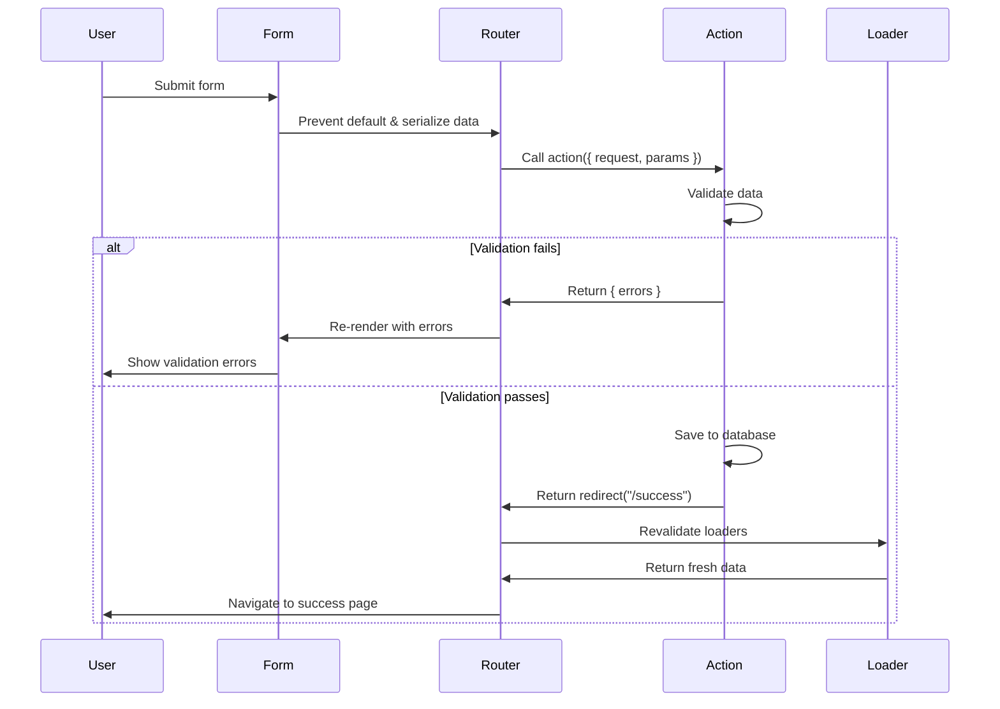

# Form Handling

React Router's Form component enhances HTML forms with client-side navigation, optimistic UI, and automatic revalidation. It's the primary way to handle user input and mutations.

## Basic Form

The `<Form>` component works like a regular HTML form but prevents full page reloads:

```tsx
import { Form } from "react-router";

export default function CreateProduct() {
  return (
    <Form method="post">
      <label>
        Name: <input name="name" required />
      </label>
      <label>
        Price: <input name="price" type="number" required />
      </label>
      <button type="submit">Create Product</button>
    </Form>
  );
}

export async function action({ request }) {
  const formData = await request.formData();
  const product = {
    name: formData.get("name"),
    price: formData.get("price"),
  };
  
  await db.products.create(product);
  return redirect("/products");
}
```

## Form Methods

### GET - Search and Filters

```tsx
<Form method="get" action="/products">
  <input name="search" placeholder="Search..." />
  <select name="category">
    <option value="all">All Categories</option>
    <option value="electronics">Electronics</option>
  </select>
  <button type="submit">Search</button>
</Form>

// Navigates to: /products?search=laptop&category=electronics
```

GET forms update the URL and call loaders:

```tsx
export async function loader({ request }) {
  const url = new URL(request.url);
  const search = url.searchParams.get("search");
  const category = url.searchParams.get("category");
  
  const products = await db.products.search({ search, category });
  return { products };
}
```

### POST - Create Resources

```tsx
<Form method="post">
  <input name="title" />
  <textarea name="body" />
  <button type="submit">Create Post</button>
</Form>

export async function action({ request }) {
  const formData = await request.formData();
  await db.posts.create(Object.fromEntries(formData));
  return redirect("/posts");
}
```

### PUT/PATCH - Update Resources

```tsx
<Form method="put">
  <input name="name" defaultValue={product.name} />
  <button type="submit">Update</button>
</Form>

export async function action({ request, params }) {
  const formData = await request.formData();
  
  if (request.method === "PUT") {
    await db.products.update(params.id, Object.fromEntries(formData));
  }
  
  return redirect(`/products/${params.id}`);
}
```

### DELETE - Remove Resources

```tsx
<Form method="delete">
  <button type="submit">Delete Product</button>
</Form>

export async function action({ request, params }) {
  if (request.method === "DELETE") {
    await db.products.delete(params.id);
    return redirect("/products");
  }
}
```

## Form Data

### Reading Form Data

```tsx
export async function action({ request }) {
  const formData = await request.formData();
  
  // Individual fields
  const email = formData.get("email");
  const password = formData.get("password");
  
  // Multiple values (checkboxes)
  const interests = formData.getAll("interests");
  
  // Convert to object
  const data = Object.fromEntries(formData);
  
  // Check if field exists
  const hasNewsletter = formData.has("newsletter");
  
  return { data };
}
```

### File Uploads

```tsx
<Form method="post" encType="multipart/form-data">
  <input type="file" name="avatar" accept="image/*" />
  <button type="submit">Upload</button>
</Form>

export async function action({ request }) {
  const formData = await request.formData();
  const avatar = formData.get("avatar"); // File object
  
  if (avatar instanceof File) {
    const buffer = await avatar.arrayBuffer();
    await uploadToStorage(buffer, avatar.name);
  }
  
  return { success: true };
}
```

## Form State

### Using Navigation

```tsx
import { Form, useNavigation } from "react-router";

export default function ContactForm() {
  const navigation = useNavigation();
  const isSubmitting = navigation.state === "submitting";
  
  return (
    <Form method="post">
      <input name="email" />
      <button type="submit" disabled={isSubmitting}>
        {isSubmitting ? "Sending..." : "Send"}
      </button>
    </Form>
  );
}
```

### Accessing Submission Data

```tsx
import { useNavigation } from "react-router";

function ProductForm() {
  const navigation = useNavigation();
  
  // Access form data during submission
  if (navigation.state === "submitting") {
    const productName = navigation.formData?.get("name");
    return <div>Creating {productName}...</div>;
  }
  
  return <Form method="post">{/* fields */}</Form>;
}
```

## Validation

### Client-Side Validation

```tsx
<Form method="post">
  <input 
    name="email" 
    type="email" 
    required 
    pattern="[^@]+@[^@]+\.[^@]+"
  />
  <input 
    name="age" 
    type="number" 
    min="18" 
    max="120" 
  />
  <button type="submit">Submit</button>
</Form>
```

### Server-Side Validation

```tsx
export async function action({ request }) {
  const formData = await request.formData();
  const email = formData.get("email");
  const password = formData.get("password");
  
  const errors = {};
  
  if (!email?.includes("@")) {
    errors.email = "Invalid email address";
  }
  
  if (password.length < 8) {
    errors.password = "Password must be at least 8 characters";
  }
  
  if (Object.keys(errors).length > 0) {
    return { errors };
  }
  
  await createUser({ email, password });
  return redirect("/dashboard");
}

export default function Signup() {
  const actionData = useActionData<typeof action>();
  
  return (
    <Form method="post">
      <div>
        <input name="email" />
        {actionData?.errors?.email && (
          <span style={{ color: "red" }}>
            {actionData.errors.email}
          </span>
        )}
      </div>
      
      <div>
        <input name="password" type="password" />
        {actionData?.errors?.password && (
          <span style={{ color: "red" }}>
            {actionData.errors.password}
          </span>
        )}
      </div>
      
      <button type="submit">Sign Up</button>
    </Form>
  );
}
```

## Form Submission Flow



## Fetcher Forms

Submit forms without navigation:

```tsx
import { useFetcher } from "react-router";

function NewsletterSignup() {
  const fetcher = useFetcher();
  const isSubscribed = fetcher.data?.subscribed;
  
  return (
    <fetcher.Form method="post" action="/newsletter/subscribe">
      {isSubscribed ? (
        <p>Thanks for subscribing!</p>
      ) : (
        <>
          <input name="email" placeholder="your@email.com" />
          <button type="submit">
            {fetcher.state === "submitting" 
              ? "Subscribing..." 
              : "Subscribe"}
          </button>
        </>
      )}
    </fetcher.Form>
  );
}
```

### Multiple Fetchers

```tsx
function TodoList() {
  const { todos } = useLoaderData();
  
  return (
    <ul>
      {todos.map(todo => (
        <TodoItem key={todo.id} todo={todo} />
      ))}
    </ul>
  );
}

function TodoItem({ todo }) {
  const fetcher = useFetcher();
  
  return (
    <li>
      <fetcher.Form method="post">
        <input type="hidden" name="id" value={todo.id} />
        <input 
          type="checkbox" 
          name="complete"
          defaultChecked={todo.complete}
          onChange={e => fetcher.submit(e.currentTarget.form)}
        />
        {todo.title}
      </fetcher.Form>
    </li>
  );
}
```

## Programmatic Submission

### useSubmit Hook

```tsx
import { useSubmit } from "react-router";

function ImageUpload() {
  const submit = useSubmit();
  
  return (
    <input
      type="file"
      onChange={(e) => {
        const formData = new FormData();
        formData.append("image", e.target.files[0]);
        submit(formData, { method: "post" });
      }}
    />
  );
}
```

### Submit Options

```tsx
const submit = useSubmit();

// Submit form element
submit(formElement, { method: "post" });

// Submit FormData
const formData = new FormData();
formData.append("key", "value");
submit(formData, { method: "post", action: "/api/endpoint" });

// Submit plain object
submit({ key: "value" }, { 
  method: "post",
  encType: "application/json" 
});

// Submit with options
submit(formData, {
  method: "post",
  action: "/api/submit",
  navigate: false, // Don't navigate
  fetcherKey: "my-fetcher", // Use specific fetcher
  replace: true, // Replace history entry
});
```

## Optimistic UI

```tsx
function ToggleFavorite({ productId, isFavorite }) {
  const fetcher = useFetcher();
  
  // Optimistic state
  const optimisticFavorite = fetcher.formData
    ? fetcher.formData.get("favorite") === "true"
    : isFavorite;
  
  return (
    <fetcher.Form method="post">
      <input type="hidden" name="productId" value={productId} />
      <input type="hidden" name="favorite" value={!optimisticFavorite} />
      <button type="submit">
        {optimisticFavorite ? "❤️" : "🤍"}
      </button>
    </fetcher.Form>
  );
}
```

## Form Actions

### Multiple Actions in One Route

```tsx
export async function action({ request }) {
  const formData = await request.formData();
  const intent = formData.get("intent");
  
  switch (intent) {
    case "create":
      return createProduct(formData);
    case "update":
      return updateProduct(formData);
    case "delete":
      return deleteProduct(formData);
    default:
      throw new Error("Invalid intent");
  }
}

export default function ProductForm() {
  return (
    <>
      <Form method="post">
        <input type="hidden" name="intent" value="create" />
        {/* fields */}
        <button type="submit">Create</button>
      </Form>
      
      <Form method="post">
        <input type="hidden" name="intent" value="delete" />
        <button type="submit">Delete</button>
      </Form>
    </>
  );
}
```

### Button-Based Actions

```tsx
<Form method="post">
  <input name="id" value={product.id} />
  <button name="intent" value="save">Save</button>
  <button name="intent" value="saveAndContinue">Save & Continue</button>
  <button name="intent" value="delete">Delete</button>
</Form>

export async function action({ request }) {
  const formData = await request.formData();
  const intent = formData.get("intent");
  
  switch (intent) {
    case "save":
      await save(formData);
      return redirect("/list");
    case "saveAndContinue":
      await save(formData);
      return redirect("/edit/next");
    case "delete":
      await deleteItem(formData);
      return redirect("/list");
  }
}
```

## Form Reset

```tsx
import { Form, useActionData, useNavigation } from "react-router";
import { useEffect, useRef } from "react";

export default function ContactForm() {
  const actionData = useActionData();
  const navigation = useNavigation();
  const formRef = useRef();
  
  // Reset form after successful submission
  useEffect(() => {
    if (navigation.state === "idle" && actionData?.success) {
      formRef.current?.reset();
    }
  }, [navigation.state, actionData]);
  
  return (
    <Form ref={formRef} method="post">
      <input name="message" />
      <button type="submit">Send</button>
      {actionData?.success && <p>Message sent!</p>}
    </Form>
  );
}
```

## Best Practices

1. **Use Form for mutations** - Not regular `<form>`
2. **Validate on server** - Never trust client validation alone
3. **Return errors, don't throw** - Better UX for validation failures
4. **Use fetchers for inline interactions** - Likes, toggles, etc.
5. **Implement optimistic UI** - Update immediately, confirm later
6. **Disable buttons during submission** - Prevent double submits
7. **Reset forms after success** - Clear fields when appropriate
8. **Use intent fields** - Handle multiple actions in one route
9. **Follow POST/Redirect/GET** - Redirect after successful mutations
10. **Provide loading states** - Show progress during submission
