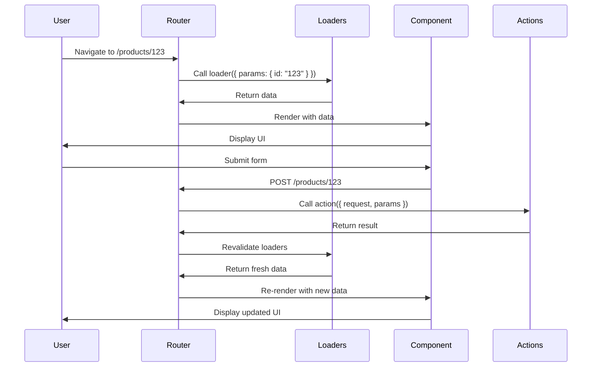
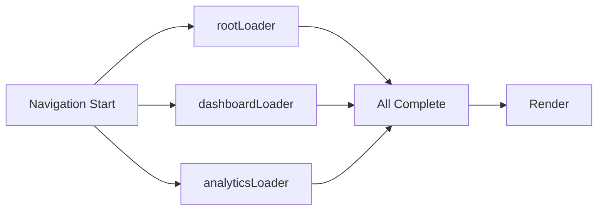

# Loaders and Actions

Loaders and actions are the primary way to load and mutate data in React Router. They run on the server in Framework mode and enable powerful patterns like optimistic UI, automatic revalidation, and error handling.

## Loaders

Loaders fetch data before a route renders. They're called before your component renders, ensuring data is ready immediately.

### Basic Loader

```tsx
// app/routes/products.$id.tsx
import { useLoaderData } from "react-router";

export async function loader({ params }) {
  const product = await db.products.find(params.id);
  return { product };
}

export default function Product() {
  const { product } = useLoaderData<typeof loader>();
  return <h1>{product.name}</h1>;
}
```

### Loader Function Signature

From `lib/router/utils.ts`, loaders receive `LoaderFunctionArgs`:

```tsx
export interface LoaderFunctionArgs {
  request: Request;        // Web Fetch API Request
  params: Params;          // Route params like { id: "123" }
  context?: unknown;       // Server context from getLoadContext()
  unstable_pattern: string; // The route pattern that matched
}

export interface LoaderFunction {
  (args: LoaderFunctionArgs): Promise<Response> | Response | Promise<any> | any;
}
```

### Accessing Request Data

Loaders receive a standard [Web Fetch API Request](https://developer.mozilla.org/en-US/docs/Web/API/Request):

```tsx
export async function loader({ request, params }) {
  // URL and search params
  const url = new URL(request.url);
  const searchTerm = url.searchParams.get("q");
  
  // Headers
  const userAgent = request.headers.get("User-Agent");
  
  // Cookies (via headers)
  const cookie = request.headers.get("Cookie");
  
  return { searchTerm, userAgent };
}
```

### Returning Data

Loaders can return various response types:

```tsx
// Plain objects (automatically serialized)
export async function loader() {
  return { user: { name: "John" } };
}

// Response objects
export async function loader() {
  return new Response(JSON.stringify({ data }), {
    headers: { "Content-Type": "application/json" }
  });
}

// Responses with custom headers
export async function loader() {
  return Response.json({ data }, {
    headers: { 
      "Cache-Control": "max-age=300",
      "Set-Cookie": "token=abc123"
    }
  });
}
```

### Error Handling in Loaders

```tsx
export async function loader({ params }) {
  const product = await db.products.find(params.id);
  
  if (!product) {
    throw new Response("Not Found", { status: 404 });
  }
  
  return { product };
}
```

Errors thrown from loaders are caught by the nearest `ErrorBoundary`.

## Actions

Actions handle data mutations triggered by form submissions or imperative calls.

### Basic Action

```tsx
// app/routes/products.$id.tsx
import { Form, redirect } from "react-router";

export async function action({ request, params }) {
  const formData = await request.formData();
  const updates = {
    name: formData.get("name"),
    price: formData.get("price"),
  };
  
  await db.products.update(params.id, updates);
  return redirect(`/products/${params.id}`);
}

export default function EditProduct() {
  return (
    <Form method="post">
      <input name="name" />
      <input name="price" />
      <button type="submit">Save</button>
    </Form>
  );
}
```

### Action Function Signature

```tsx
export interface ActionFunctionArgs {
  request: Request;
  params: Params;
  context?: unknown;
  unstable_pattern: string;
}

export interface ActionFunction {
  (args: ActionFunctionArgs): Promise<Response> | Response | Promise<any> | any;
}
```

### Handling Form Data

```tsx
export async function action({ request }) {
  const formData = await request.formData();
  
  // Get individual fields
  const email = formData.get("email");
  const password = formData.get("password");
  
  // Get all values for a field (for checkboxes)
  const tags = formData.getAll("tags");
  
  // Convert to object
  const data = Object.fromEntries(formData);
  
  // Handle file uploads
  const avatar = formData.get("avatar"); // File object
  
  return { success: true };
}
```

### Different HTTP Methods

```tsx
export async function action({ request, params }) {
  switch (request.method) {
    case "POST":
      return createProduct(await request.formData());
    
    case "PUT":
    case "PATCH":
      return updateProduct(params.id, await request.formData());
    
    case "DELETE":
      return deleteProduct(params.id);
    
    default:
      throw new Response("Method Not Allowed", { status: 405 });
  }
}
```

### Returning Action Data

Action data is available via `useActionData`:

```tsx
import { useActionData, Form } from "react-router";

export async function action({ request }) {
  const formData = await request.formData();
  const errors = await validate(formData);
  
  if (errors) {
    return { errors }; // Return validation errors
  }
  
  await saveData(formData);
  return { success: true };
}

export default function ContactForm() {
  const actionData = useActionData<typeof action>();
  
  return (
    <Form method="post">
      <input name="email" />
      {actionData?.errors?.email && (
        <span>{actionData.errors.email}</span>
      )}
      <button>Submit</button>
      {actionData?.success && <p>Saved!</p>}
    </Form>
  );
}
```

## Data Flow

The complete data flow for navigation and mutations:



## Revalidation

After an action completes, React Router automatically revalidates loaders to keep UI in sync.

### Automatic Revalidation

```tsx
// When this action completes...
export async function action() {
  await db.products.create({ name: "New Product" });
  return redirect("/products");
}

// ...this loader is automatically called again
export async function loader() {
  return { products: await db.products.findAll() };
}
```

### Controlling Revalidation

You can prevent revalidation when it's not needed:

```tsx
export function shouldRevalidate({ currentParams, nextParams }) {
  // Only revalidate if the id changed
  return currentParams.id !== nextParams.id;
}
```

From `lib/router/router.ts`, the `shouldRevalidate` function receives:

```tsx
export interface ShouldRevalidateFunctionArgs {
  currentUrl: URL;
  currentParams: Params;
  nextUrl: URL;
  nextParams: Params;
  formMethod?: FormMethod;
  formAction?: string;
  formEncType?: FormEncType;
  formData?: FormData;
  actionResult?: DataResult;
  defaultShouldRevalidate: boolean;
}
```

### Manual Revalidation

```tsx
import { useRevalidator } from "react-router";

function ProductList() {
  const revalidator = useRevalidator();
  
  return (
    <div>
      <button onClick={() => revalidator.revalidate()}>
        Refresh
      </button>
      {revalidator.state === "loading" && <Spinner />}
    </div>
  );
}
```

## Parallel Data Loading

React Router loads all matching route loaders in parallel:

```tsx
// All three loaders run simultaneously
const routes = [
  {
    path: "/",
    loader: rootLoader,      // Loads user session
    children: [
      {
        path: "dashboard",
        loader: dashboardLoader, // Loads dashboard data
        children: [
          {
            path: "analytics",
            loader: analyticsLoader, // Loads analytics data
          }
        ]
      }
    ]
  }
];
```



## Context and Request Context

In Framework mode, you can provide context to loaders and actions:

```tsx
// Server setup
import { createRequestHandler } from "@react-router/node";

export default createRequestHandler({
  build: require("./build/server"),
  getLoadContext(request) {
    return {
      db: await getDatabase(),
      user: await getUser(request),
    };
  },
});
```

Using context in loaders:

```tsx
export async function loader({ context }) {
  const products = await context.db.products.findAll();
  return { products, user: context.user };
}
```

## Redirects

Redirecting from loaders and actions:

```tsx
import { redirect } from "react-router";

export async function loader({ request, context }) {
  if (!context.user) {
    return redirect("/login");
  }
  return { data };
}

export async function action({ request }) {
  const product = await createProduct(await request.formData());
  return redirect(`/products/${product.id}`);
}
```

From `lib/router/utils.ts`, `redirect` creates a special Response:

```tsx
export const redirect = (
  url: string,
  init: number | ResponseInit = 302
): Response => {
  let responseInit = init;
  if (typeof responseInit === "number") {
    responseInit = { status: responseInit };
  }
  
  return new Response(null, {
    ...responseInit,
    headers: {
      ...responseInit.headers,
      Location: url,
    },
  });
};
```

## Deferred Data

For streaming SSR, you can defer slow data:

```tsx
import { defer } from "react-router";

export async function loader() {
  const criticalData = await getCriticalData(); // Wait for this
  const slowData = getSlowData(); // Don't wait, return promise
  
  return defer({
    critical: criticalData,
    slow: slowData, // Promise
  });
}
```

Consume deferred data with `<Await>`:

```tsx
import { Await, useLoaderData } from "react-router";
import { Suspense } from "react";

export default function Page() {
  const { critical, slow } = useLoaderData<typeof loader>();
  
  return (
    <div>
      <h1>{critical.title}</h1>
      <Suspense fallback={<Spinner />}>
        <Await resolve={slow}>
          {(data) => <Details data={data} />}
        </Await>
      </Suspense>
    </div>
  );
}
```

## Type Safety

React Router provides full type inference:

```tsx
export async function loader() {
  return {
    user: { name: "John", age: 30 },
    products: [{ id: 1, name: "Widget" }]
  };
}

export default function Component() {
  // TypeScript infers the exact type!
  const { user, products } = useLoaderData<typeof loader>();
  //     ^? { name: string; age: number }
  //             ^? { id: number; name: string }[]
}
```

## Best Practices

1. **Keep loaders focused** - Each loader should fetch data for its route
2. **Use actions for mutations** - Keep side effects in actions, not loaders
3. **Return semantic HTTP responses** - Use proper status codes (404, 500, etc.)
4. **Leverage parallel loading** - Structure routes to load data in parallel
5. **Handle errors gracefully** - Throw responses to trigger error boundaries
6. **Use redirect after mutations** - Follow the Post/Redirect/Get pattern
7. **Validate in actions** - Return validation errors instead of throwing
8. **Revalidate wisely** - Use `shouldRevalidate` to optimize unnecessary loads
