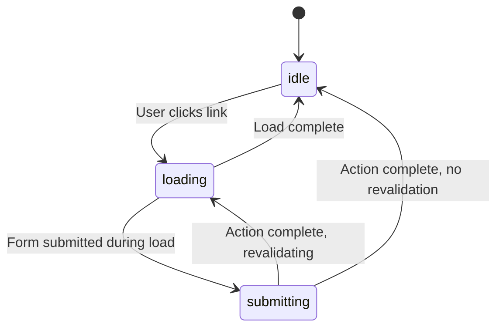
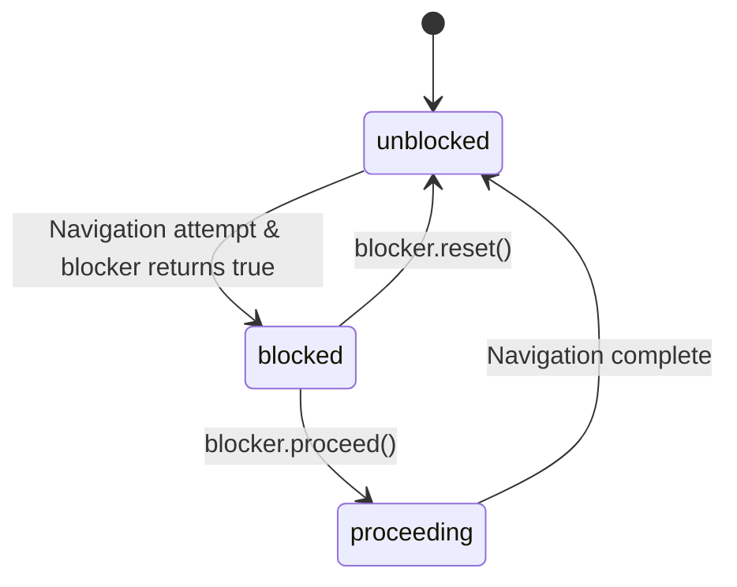
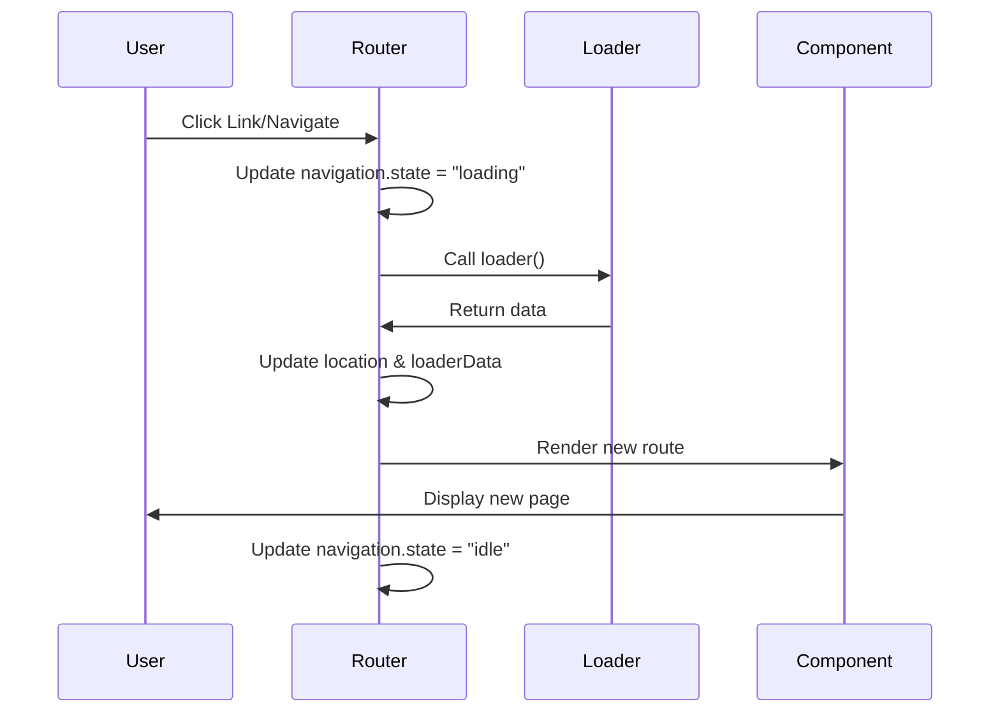

# Navigation Concepts

React Router provides multiple ways to navigate between routes, from declarative components to imperative APIs. Understanding when and how to use each method is key to building intuitive applications.

## Navigation Methods

### Link Component

The `<Link>` component is the primary way to navigate:

```tsx
import { Link } from "react-router";

function Navigation() {
  return (
    <nav>
      <Link to="/">Home</Link>
      <Link to="/about">About</Link>
      <Link to="/contact">Contact</Link>
    </nav>
  );
}
```

### NavLink Component

`<NavLink>` adds active styling automatically:

```tsx
import { NavLink } from "react-router";

function Navigation() {
  return (
    <nav>
      <NavLink 
        to="/"
        className={({ isActive }) => isActive ? "active" : ""}
      >
        Home
      </NavLink>
      <NavLink 
        to="/about"
        style={({ isActive }) => ({
          fontWeight: isActive ? "bold" : "normal"
        })}
      >
        About
      </NavLink>
    </nav>
  );
}
```

### useNavigate Hook

For programmatic navigation:

```tsx
import { useNavigate } from "react-router";

function LoginForm() {
  const navigate = useNavigate();
  
  async function handleSubmit(event) {
    event.preventDefault();
    await login(formData);
    navigate("/dashboard");
  }
  
  return <form onSubmit={handleSubmit}>{/* ... */}</form>;
}
```

From `lib/hooks.tsx:379`, the navigate function signature:

```tsx
export interface NavigateFunction {
  (to: To, options?: NavigateOptions): void | Promise<void>;
  (delta: number): void | Promise<void>;
}
```

### Navigate Component

Declarative navigation (useful in class components):

```tsx
import { Navigate } from "react-router";

function ProtectedRoute({ user, children }) {
  if (!user) {
    return <Navigate to="/login" replace />;
  }
  return children;
}
```

## Navigation Options

### Replace vs Push

```tsx
// Push (default) - adds to history stack
navigate("/new-page"); // Can go back

// Replace - replaces current entry
navigate("/new-page", { replace: true }); // Can't go back
```

```mermaid
graph LR
    subgraph Push Navigation
    A1[/home] --> B1[/about]
    B1 --> C1[/contact]
    end
    
    subgraph Replace Navigation
    A2[/home] --> B2[/contact]
    end
```

### State

Pass state that doesn't belong in the URL:

```tsx
// Navigate with state
navigate("/product", {
  state: { from: "/cart", discount: 0.1 }
});

// Access state in the destination
import { useLocation } from "react-router";

function Product() {
  const location = useLocation();
  const { from, discount } = location.state || {};
  // from = "/cart", discount = 0.1
}
```

### Prevent Scroll Reset

In Data/Framework modes:

```tsx
navigate("/page?tab=2", {
  preventScrollReset: true // Don't scroll to top
});
```

### View Transitions

Enable view transitions API:

```tsx
navigate("/page", {
  viewTransition: true // Uses document.startViewTransition
});
```

### Flush Sync

Force synchronous DOM updates:

```tsx
navigate("/page", {
  flushSync: true // Uses ReactDOM.flushSync
});
```

## Relative Navigation

### Route-Relative (Default)

Relative to the route hierarchy:

```tsx
// Current route: /dashboard/settings (child of /dashboard)
navigate(".."); // Goes to /dashboard (parent route)
navigate("profile"); // Goes to /dashboard/profile (sibling)
```

### Path-Relative

Relative to URL path segments:

```tsx
// Current URL: /dashboard/settings
navigate("..", { relative: "path" }); // Goes to /dashboard
navigate("../profile", { relative: "path" }); // Goes to /dashboard/profile
```

### Absolute Navigation

```tsx
navigate("/home"); // Always goes to /home, regardless of current location
```

## History Navigation

### Go Back/Forward

```tsx
const navigate = useNavigate();

// Go back one page
navigate(-1);

// Go forward one page
navigate(1);

// Go back two pages
navigate(-2);
```

### Caution with Delta Navigation

From `lib/hooks.tsx:301`:

```tsx
// Be cautious - user may not have history entries
// Could navigate away from your app!
function BackButton() {
  const navigate = useNavigate();
  
  // Better: Track if user came from within your app
  const location = useLocation();
  const canGoBack = location.key !== "default";
  
  return (
    <button 
      onClick={() => navigate(-1)}
      disabled={!canGoBack}
    >
      Back
    </button>
  );
}
```

## Navigation State

Track navigation status:

```tsx
import { useNavigation } from "react-router";

function GlobalSpinner() {
  const navigation = useNavigation();
  
  return navigation.state === "loading" ? <Spinner /> : null;
}
```

Navigation states:



The `Navigation` type from `lib/router/router.ts`:

```tsx
export type Navigation = 
  | { state: "idle" }
  | {
      state: "loading";
      location: Location;
      formMethod?: FormMethod;
      formAction?: string;
      formEncType?: FormEncType;
      formData?: FormData;
    }
  | {
      state: "submitting";
      location: Location;
      formMethod: FormMethod;
      formAction: string;
      formEncType: FormEncType;
      formData: FormData;
    };
```

## Form Navigation

Forms trigger navigation with data mutations:

```tsx
import { Form } from "react-router";

function CreateProduct() {
  return (
    <Form method="post" action="/products">
      <input name="name" />
      <input name="price" />
      <button type="submit">Create</button>
    </Form>
  );
}
```

### Form Methods

```tsx
// GET - navigation with search params
<Form method="get" action="/search">
  <input name="q" />
  <button>Search</button>
</Form>
// Navigates to: /search?q=query

// POST - submits to action
<Form method="post">
  <input name="email" />
  <button>Subscribe</button>
</Form>
// Calls action function, then revalidates

// PUT/PATCH/DELETE
<Form method="put">
<Form method="patch">
<Form method="delete">
```

## Blocking Navigation

Prevent navigation during unsaved changes:

```tsx
import { useBlocker } from "react-router";

function EditForm() {
  const [isDirty, setIsDirty] = useState(false);
  
  const blocker = useBlocker(
    ({ currentLocation, nextLocation }) =>
      isDirty && currentLocation.pathname !== nextLocation.pathname
  );
  
  return (
    <>
      <form onChange={() => setIsDirty(true)}>
        {/* form fields */}
      </form>
      
      {blocker.state === "blocked" && (
        <div>
          <p>You have unsaved changes!</p>
          <button onClick={() => blocker.proceed()}>Leave</button>
          <button onClick={() => blocker.reset()}>Stay</button>
        </div>
      )}
    </>
  );
}
```

Blocker states:



## Location

Access current location:

```tsx
import { useLocation } from "react-router";

function CurrentRoute() {
  const location = useLocation();
  
  return (
    <div>
      <p>Pathname: {location.pathname}</p>
      <p>Search: {location.search}</p>
      <p>Hash: {location.hash}</p>
      <p>State: {JSON.stringify(location.state)}</p>
      <p>Key: {location.key}</p>
    </div>
  );
}
```

Location object structure from `lib/router/history.ts`:

```tsx
export interface Location {
  pathname: string;     // "/products/123"
  search: string;       // "?sort=price"
  hash: string;         // "#reviews"
  state: unknown;       // User-defined state
  key: string;          // Unique key for this location
}
```

## Search Params

Work with query strings:

```tsx
import { useSearchParams } from "react-router";

function ProductFilters() {
  const [searchParams, setSearchParams] = useSearchParams();
  
  const category = searchParams.get("category");
  const sort = searchParams.get("sort");
  
  return (
    <div>
      <button onClick={() => {
        setSearchParams({ category: "electronics", sort: "price" });
      }}>
        Electronics by Price
      </button>
      
      <button onClick={() => {
        setSearchParams((prev) => {
          prev.set("sort", "name");
          return prev;
        });
      }}>
        Sort by Name
      </button>
    </div>
  );
}
```

## Basename

Mount app at a subdirectory:

```tsx
const router = createBrowserRouter(routes, {
  basename: "/app"
});

// <Link to="/home"> renders <a href="/app/home">
// navigate("/home") goes to /app/home
```

## Hash Navigation

Navigate to anchor links:

```tsx
<Link to="#section-2">Jump to Section 2</Link>

navigate("#pricing"); // Scrolls to element with id="pricing"
```

## External Navigation

For external links, use regular `<a>` tags:

```tsx
// Don't use Link for external URLs
<a href="https://example.com">External Site</a>

// Or navigate programmatically
window.location.href = "https://example.com";
```

## Scroll Restoration

Automatic scroll position restoration:

```tsx
import { ScrollRestoration } from "react-router";

function Root() {
  return (
    <>
      <Outlet />
      <ScrollRestoration />
    </>
  );
}
```

Customize scroll behavior:

```tsx
<ScrollRestoration
  getKey={(location) => {
    // Don't reset scroll for tab changes
    return location.pathname;
  }}
/>
```

## Navigation Lifecycle



## Best Practices

1. **Use Link for internal navigation** - Better performance and user experience
2. **Use navigate() for post-mutation redirects** - After forms, login, etc.
3. **Prefer replace for redirects** - Especially for auth redirects
4. **Use state for non-URL data** - Modal backgrounds, scroll positions
5. **Block navigation carefully** - Only for critical unsaved changes
6. **Handle missing history** - Check if user can actually go back
7. **Use NavLink for navigation menus** - Automatic active states
8. **Leverage view transitions** - For smooth page transitions
