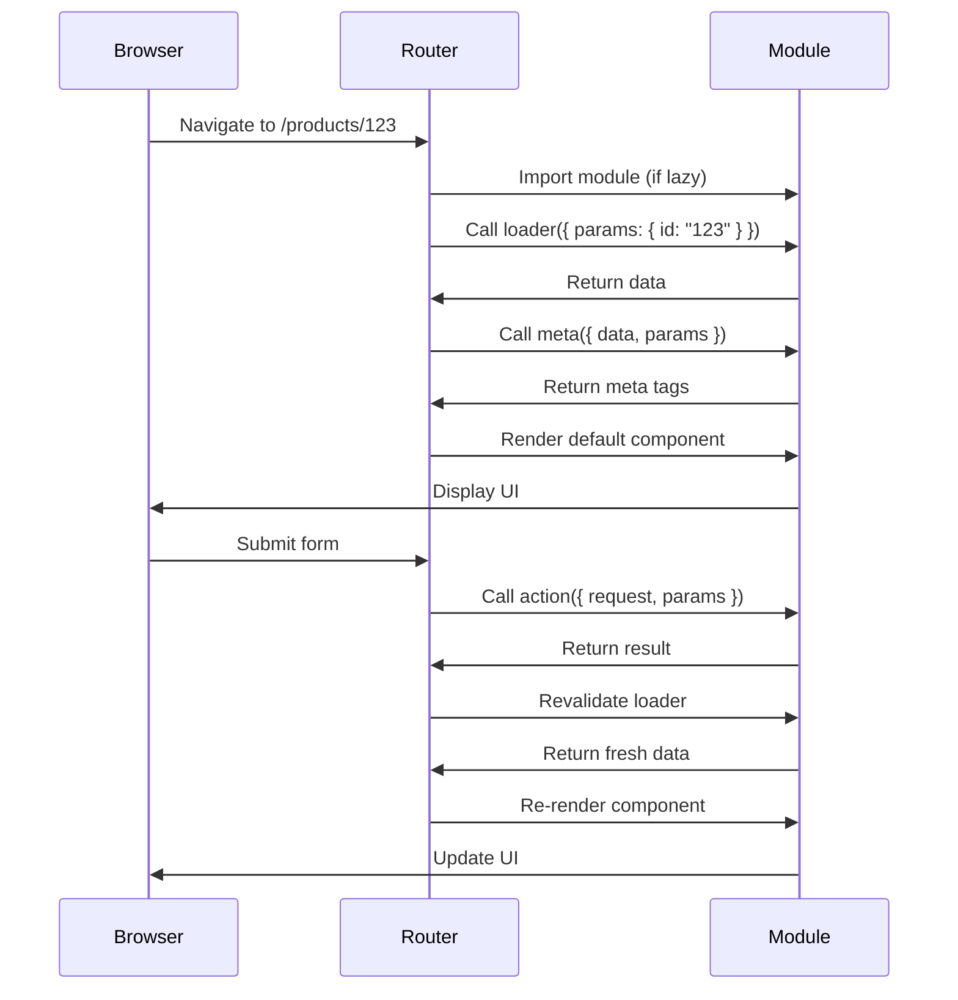

# Route Module API

In Framework mode, route modules are files that export specific functions and components that define your route's behavior. React Router calls these exports at the right time to load data, handle mutations, and render UI.

## Route Module Structure

From `lib/types/route-module.ts`, a route module can export:

```tsx
export type RouteModule = {
  meta?: Func;          // Define <meta> tags
  links?: Func;         // Define <link> tags
  headers?: Func;       // Set HTTP headers
  loader?: Func;        // Load data
  clientLoader?: Func;  // Load data on client
  action?: Func;        // Handle mutations
  clientAction?: Func;  // Handle mutations on client
  HydrateFallback?: Func; // Loading UI during hydration
  default?: Func;       // The component
  ErrorBoundary?: Func; // Error UI
  [key: string]: unknown; // Custom exports allowed
};
```

## Component Export

The default export is your route's component:

```tsx
// app/routes/products.$id.tsx
export default function Product() {
  return <div>Product Page</div>;
}
```

### Using Loader Data

```tsx
import { useLoaderData } from "react-router";

export async function loader({ params }) {
  return { product: await db.products.find(params.id) };
}

export default function Product() {
  const { product } = useLoaderData<typeof loader>();
  return (
    <div>
      <h1>{product.name}</h1>
      <p>{product.description}</p>
    </div>
  );
}
```

## Loader

Loaders run before the route renders:

```tsx
export async function loader({ request, params, context }) {
  const url = new URL(request.url);
  const searchTerm = url.searchParams.get("q");
  
  const [products, categories] = await Promise.all([
    db.products.search(searchTerm),
    db.categories.findAll(),
  ]);
  
  return { products, categories, searchTerm };
}
```

### Loader Arguments

```tsx
interface LoaderFunctionArgs {
  request: Request;        // Fetch API Request
  params: Params;          // URL params { id: "123" }
  context?: AppLoadContext; // Server context
  unstable_pattern: string; // Route pattern
}
```

### Loader Returns

```tsx
// Plain object
return { data };

// Response
return new Response(JSON.stringify(data), {
  headers: { "Content-Type": "application/json" }
});

// Redirect
import { redirect } from "react-router";
return redirect("/login");

// Error
throw new Response("Not Found", { status: 404 });
```

## Action

Actions handle form submissions and mutations:

```tsx
export async function action({ request, params }) {
  const formData = await request.formData();
  
  const product = {
    name: formData.get("name"),
    price: Number(formData.get("price")),
  };
  
  // Validate
  const errors = validate(product);
  if (errors) {
    return { errors };
  }
  
  // Save
  await db.products.update(params.id, product);
  
  return redirect(`/products/${params.id}`);
}
```

### Using Action Data

```tsx
import { Form, useActionData } from "react-router";

export default function EditProduct() {
  const actionData = useActionData<typeof action>();
  
  return (
    <Form method="post">
      <input name="name" />
      {actionData?.errors?.name && (
        <span>{actionData.errors.name}</span>
      )}
      
      <input name="price" />
      {actionData?.errors?.price && (
        <span>{actionData.errors.price}</span>
      )}
      
      <button type="submit">Save</button>
    </Form>
  );
}
```

## Client Loader

Runs on the client for SPA-style data loading:

```tsx
export async function clientLoader({ request, params, serverLoader }) {
  // Option 1: Client-only data loading
  const data = await fetch(`/api/products/${params.id}`);
  return data.json();
  
  // Option 2: Enhance server data
  const serverData = await serverLoader();
  const clientData = await getClientData();
  return { ...serverData, ...clientData };
}

// Mark this as client-only
clientLoader.hydrate = true;
```

### Hydration

```tsx
// Skip server loader during hydration
export async function clientLoader({ serverLoader }) {
  // Only run on client navigations, not initial load
  return serverLoader();
}
clientLoader.hydrate = false; // Skip during SSR hydration
```

## Client Action

Handle mutations on the client:

```tsx
export async function clientAction({ request, params, serverAction }) {
  // Optimistic UI update
  updateUIOptimistically();
  
  try {
    // Call server action
    const result = await serverAction();
    return result;
  } catch (error) {
    // Revert optimistic update
    revertUIUpdate();
    throw error;
  }
}
```

## Error Boundary

Handle errors thrown from loaders, actions, or render:

```tsx
import { useRouteError, isRouteErrorResponse } from "react-router";

export function ErrorBoundary() {
  const error = useRouteError();
  
  if (isRouteErrorResponse(error)) {
    return (
      <div>
        <h1>{error.status} {error.statusText}</h1>
        <p>{error.data}</p>
      </div>
    );
  }
  
  return (
    <div>
      <h1>Error!</h1>
      <p>{error.message}</p>
    </div>
  );
}
```

### Error Types

From `lib/router/utils.ts`:

```tsx
// Thrown Response (404, 500, etc.)
throw new Response("Not Found", { status: 404 });

// Regular Error
throw new Error("Something went wrong");

// Route Error Response helper
import { data } from "react-router";
throw data({ message: "Not found" }, { status: 404 });
```

## Hydrate Fallback

Show loading UI during initial hydration:

```tsx
export function HydrateFallback() {
  return (
    <div>
      <Skeleton />
      <p>Loading...</p>
    </div>
  );
}
```

## Meta

Define document metadata:

```tsx
export function meta({ data, params, matches }) {
  return [
    { title: data.product.name },
    { name: "description", content: data.product.description },
    { property: "og:image", content: data.product.imageUrl },
  ];
}
```

### Meta Arguments

```tsx
interface MetaArgs {
  data: LoaderData;    // Data from this route's loader
  params: Params;      // URL params
  matches: UIMatch[];  // All route matches (access parent data)
}
```

### Meta Return Types

```tsx
return [
  { title: "Page Title" },
  { name: "description", content: "Description" },
  { property: "og:title", content: "OG Title" },
  { charset: "utf-8" },
  { tagName: "link", rel: "canonical", href: "https://example.com" },
];
```

## Links

Define link tags for stylesheets, preloads, etc.:

```tsx
export function links() {
  return [
    { rel: "stylesheet", href: "/styles/products.css" },
    { rel: "preload", href: "/fonts/custom.woff2", as: "font", type: "font/woff2" },
    { rel: "icon", href: "/favicon.ico" },
  ];
}
```

## Headers

Set HTTP response headers (SSR only):

```tsx
export function headers({ loaderHeaders, parentHeaders }) {
  return {
    "Cache-Control": "public, max-age=300",
    "X-Custom-Header": "value",
  };
}
```

### Headers Arguments

```tsx
interface HeadersArgs {
  loaderHeaders: Headers;  // Headers from loader Response
  parentHeaders: Headers;  // Headers from parent route
  actionHeaders: Headers;  // Headers from action Response
}
```

## Handle

Attach custom data to routes:

```tsx
export const handle = {
  breadcrumb: "Products",
  theme: "dark",
  permissions: ["admin"],
};

// Access in components
import { useMatches } from "react-router";

function Breadcrumbs() {
  const matches = useMatches();
  
  return (
    <nav>
      {matches
        .filter(match => match.handle?.breadcrumb)
        .map(match => (
          <span key={match.id}>{match.handle.breadcrumb}</span>
        ))}
    </nav>
  );
}
```

## Should Revalidate

Control when loaders re-run:

```tsx
export function shouldRevalidate({
  currentUrl,
  currentParams,
  nextUrl,
  nextParams,
  formMethod,
  defaultShouldRevalidate,
}) {
  // Only revalidate if ID changed
  if (currentParams.id !== nextParams.id) {
    return true;
  }
  
  // Revalidate on POST/PUT/PATCH/DELETE
  if (formMethod && formMethod !== "GET") {
    return true;
  }
  
  return false;
}
```

## Lazy Loading

Code-split routes:

```tsx
// app/routes.ts
import { route } from "@react-router/dev/routes";

export default [
  route("/products/:id", () => import("./routes/product.tsx"))
];

// app/routes/product.tsx
export async function loader({ params }) {
  return { product: await db.products.find(params.id) };
}

export default function Product() {
  // Component code
}
```

## Module Execution Flow



## Complete Example

```tsx
// app/routes/products.$id.tsx
import { Form, useLoaderData, useActionData } from "react-router";
import type { LoaderFunctionArgs, ActionFunctionArgs } from "react-router";
import { redirect } from "react-router";

// Server-side data loading
export async function loader({ params, request }: LoaderFunctionArgs) {
  const product = await db.products.find(params.id);
  
  if (!product) {
    throw new Response("Not Found", { status: 404 });
  }
  
  return { product };
}

// Handle mutations
export async function action({ request, params }: ActionFunctionArgs) {
  const formData = await request.formData();
  
  await db.products.update(params.id, {
    name: formData.get("name"),
    price: formData.get("price"),
  });
  
  return redirect(`/products/${params.id}`);
}

// Document metadata
export function meta({ data }) {
  return [
    { title: `${data.product.name} | My Store` },
    { name: "description", content: data.product.description },
  ];
}

// Stylesheets
export function links() {
  return [
    { rel: "stylesheet", href: "/styles/product.css" },
  ];
}

// Error UI
export function ErrorBoundary() {
  const error = useRouteError();
  return <div>Error: {error.message}</div>;
}

// Main component
export default function Product() {
  const { product } = useLoaderData<typeof loader>();
  
  return (
    <div>
      <h1>{product.name}</h1>
      <p>{product.description}</p>
      <p>${product.price}</p>
      
      <Form method="post">
        <input name="name" defaultValue={product.name} />
        <input name="price" defaultValue={product.price} />
        <button type="submit">Update</button>
      </Form>
    </div>
  );
}
```

## Best Practices

1. **Export types** - Use `typeof loader` for type inference
2. **Handle errors** - Always provide ErrorBoundary
3. **Validate in actions** - Return errors instead of throwing
4. **Use meta for SEO** - Set titles and descriptions
5. **Lazy load large routes** - Improve initial bundle size
6. **Control revalidation** - Optimize with shouldRevalidate
7. **Keep modules focused** - One concern per export
8. **Use handle for shared data** - Breadcrumbs, themes, etc.
