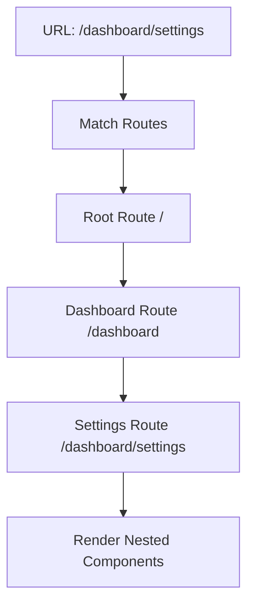
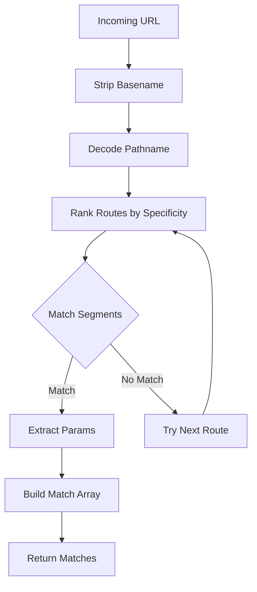

# Core Routing Concepts

React Router's routing system is built on a foundation of nested route matching, enabling you to build complex application layouts with intuitive URL structures.

## Route Matching

At its core, React Router matches URL paths to route definitions and renders the appropriate components. The router uses a nested matching algorithm that allows parent routes to render layouts while child routes render specific content.



### Basic Route Configuration

Routes can be defined declaratively using JSX or programmatically using route objects:

```tsx
// Declarative (JSX)
import { Routes, Route } from "react-router";

function App() {
  return (
    <Routes>
      <Route path="/" element={<Home />} />
      <Route path="/about" element={<About />} />
      <Route path="/blog/:slug" element={<BlogPost />} />
    </Routes>
  );
}

// Data Router (Object-based)
import { createBrowserRouter } from "react-router";

const router = createBrowserRouter([
  { path: "/", element: <Home /> },
  { path: "/about", element: <About /> },
  { path: "/blog/:slug", element: <BlogPost /> },
]);
```

## Nested Routes

Nested routes allow you to compose UI hierarchies that mirror your URL structure. Parent routes render an `<Outlet />` where child routes appear.

```tsx
const router = createBrowserRouter([
  {
    path: "/",
    element: <RootLayout />,
    children: [
      { index: true, element: <Home /> },
      {
        path: "dashboard",
        element: <DashboardLayout />,
        children: [
          { index: true, element: <DashboardHome /> },
          { path: "settings", element: <Settings /> },
          { path: "profile", element: <Profile /> },
        ],
      },
    ],
  },
]);
```

With the layout component:

```tsx
// app/routes/dashboard.tsx
import { Outlet } from "react-router";

export default function DashboardLayout() {
  return (
    <div>
      <nav>{/* Dashboard navigation */}</nav>
      <main>
        <Outlet /> {/* Child routes render here */}
      </main>
    </div>
  );
}
```

## Dynamic Segments

Dynamic segments capture values from the URL and make them available as params:

```tsx
// Route definition
{
  path: "/blog/:slug",
  element: <BlogPost />
}

// Component usage
import { useParams } from "react-router";

function BlogPost() {
  const { slug } = useParams();
  // URL: /blog/hello-world
  // slug = "hello-world"
}
```

### Multiple Dynamic Segments

```tsx
// Route: /users/:userId/posts/:postId
function UserPost() {
  const { userId, postId } = useParams();
  // URL: /users/123/posts/456
  // userId = "123", postId = "456"
}
```

### Splat Routes (Catch-all)

Splat routes capture the rest of the URL:

```tsx
{
  path: "/files/*",
  element: <FileViewer />
}

function FileViewer() {
  const params = useParams();
  const filepath = params["*"];
  // URL: /files/documents/report.pdf
  // filepath = "documents/report.pdf"
}
```

## Index Routes

Index routes render when a parent route matches exactly:

```tsx
{
  path: "/teams",
  element: <TeamsLayout />,
  children: [
    { index: true, element: <TeamsIndex /> }, // Renders at /teams
    { path: ":teamId", element: <Team /> },   // Renders at /teams/:teamId
  ]
}
```

## Route Matching Algorithm

The router matches routes using the `matchRoutes` function from `lib/router/utils.ts`. The algorithm:

1. **Normalizes the pathname** - Removes basename and decodes URI components
2. **Ranks routes** - Routes are ranked by specificity (static > dynamic > splat)
3. **Matches segments** - Each URL segment is matched against route patterns
4. **Returns matches** - Returns an array of matching routes from parent to child



## Path Matching Patterns

### Static Paths

```tsx
{ path: "/about" } // Only matches /about exactly
```

### Dynamic Segments

```tsx
{ path: "/users/:id" } // Matches /users/123, /users/abc
```

### Optional Segments

```tsx
{ path: "/posts/:slug?" } // Matches /posts and /posts/hello
```

### Splat Routes

```tsx
{ path: "/files/*" } // Matches /files/a, /files/a/b/c
```

## Case Sensitivity

By default, routes are case-insensitive. You can make them case-sensitive:

```tsx
{
  path: "/About",
  caseSensitive: true, // Only matches /About, not /about
  element: <About />
}
```

## Route Resolution

The router resolves relative paths based on the route hierarchy:

```tsx
import { useNavigate } from "react-router";

function Settings() {
  const navigate = useNavigate();
  
  // If current location is /dashboard/settings
  navigate("profile");  // Goes to /dashboard/profile
  navigate("../users"); // Goes to /dashboard/users
  navigate("/home");    // Goes to /home (absolute)
}
```

### Relative Routing Types

React Router supports two types of relative routing:

```tsx
import { Link } from "react-router";

// Route-relative (default) - relative to route hierarchy
<Link to=".." relative="route">Back</Link>

// Path-relative - relative to URL path segments
<Link to=".." relative="path">Back</Link>
```

## Layout Routes

Layout routes don't have a path and exist purely for UI organization:

```tsx
[
  {
    element: <AuthLayout />, // No path - always matches
    children: [
      { path: "/login", element: <Login /> },
      { path: "/register", element: <Register /> },
    ]
  }
]
```

## Route Ranking

When multiple routes could match, React Router uses a ranking algorithm:

1. **Static segments** (highest priority) - `/about`
2. **Dynamic segments** - `/:id`
3. **Splat routes** (lowest priority) - `/*`

```tsx
// These routes are automatically ranked:
[
  { path: "/teams/new" },      // Rank 1 (static)
  { path: "/teams/:id" },      // Rank 2 (dynamic)
  { path: "/teams/*" },        // Rank 3 (splat)
]

// URL: /teams/new matches first route (highest rank)
// URL: /teams/123 matches second route
// URL: /teams/a/b/c matches third route
```

## Basename

The basename allows you to mount your app at a subdirectory:

```tsx
const router = createBrowserRouter(routes, {
  basename: "/app"
});

// Route: { path: "/dashboard" }
// Actual URL: /app/dashboard
```

Implementation from `lib/components.tsx`:

```tsx
// The router strips the basename before matching routes
let trailingPathname = stripBasename(pathname, basename);
```

## Router Types

React Router provides different router implementations:

### BrowserRouter

Uses HTML5 history API for clean URLs:

```tsx
import { createBrowserRouter } from "react-router";

const router = createBrowserRouter(routes);
// URLs: /about, /users/123
```

### MemoryRouter

Stores history in memory (useful for testing or non-browser environments):

```tsx
import { createMemoryRouter } from "react-router";

const router = createMemoryRouter(routes, {
  initialEntries: ["/", "/about"],
  initialIndex: 1 // Start at /about
});
```

From `lib/components.tsx:311`:

```tsx
export function createMemoryRouter(
  routes: RouteObject[],
  opts?: MemoryRouterOpts,
): DataRouter {
  return createRouter({
    basename: opts?.basename,
    history: createMemoryHistory({
      initialEntries: opts?.initialEntries,
      initialIndex: opts?.initialIndex,
    }),
    routes,
    // ...
  }).initialize();
}
```

## Route Objects Structure

Route objects follow the `RouteObject` interface:

```tsx
interface RouteObject {
  path?: string;
  index?: boolean;
  children?: RouteObject[];
  caseSensitive?: boolean;
  id?: string;
  loader?: LoaderFunction;
  action?: ActionFunction;
  element?: React.ReactNode;
  Component?: React.ComponentType;
  errorElement?: React.ReactNode;
  ErrorBoundary?: React.ComponentType;
  handle?: unknown;
  shouldRevalidate?: ShouldRevalidateFunction;
  lazy?: LazyRouteFunction;
}
```

## Best Practices

1. **Use nested routes** to share layouts and reduce duplication
2. **Keep routes flat** when nesting isn't needed for clarity
3. **Use index routes** for default content at a path
4. **Order matters less** - the router ranks by specificity automatically
5. **Use relative navigation** to make components more portable
6. **Leverage layout routes** for shared UI without affecting URLs
